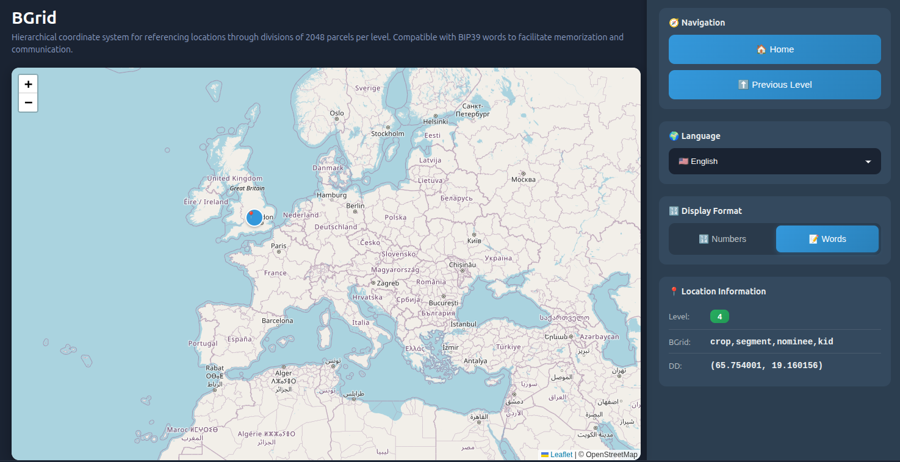

# Bgrid

Welcome to the Bgrid organization on GitHub. We collect tools, libraries and resources related to the Bgrid ecosystem: embedded clients, Python libraries, crypto utilities and technical documentation.

Website: https://bgrid.org
Contact: info@bgrid.org

## Featured repositories

Short list of public repositories hosted in this organization (links on GitHub):

- `bgrid` — Core project (fork of kudelink/bgrid). Engine and core components of the system. (License: AGPL-3.0)
- `bgrid-python` — Python tools and bindings for working with Bgrid.
- `bgrid-esp32` — Code for ESP32 devices / embedded clients in C++.
- `bgrid-js` — Code for Javascript.
- `bgrid-api-rest` — API rest for BGrid in NodeJS.
- `bip39` — Implementation/resources related to BIP-39 (mnemonics).
- `bips` — Copy/collection of Bitcoin Improvement Proposals (fork of bitcoin/bips), useful as reference.

For the full list and updated descriptions visit: https://github.com/bgrid-maps

## Want to contribute?

1. Pick a repository from the list and read its `CONTRIBUTING.md` (if present).
2. Open an issue to discuss significant changes before you start working.
3. Fork the repository, create a branch for your change, and submit a pull request describing the change.

## Licenses
Each repository may have its own license. Check the `LICENSE` file in the respective repository. Licenses used in the organization include MIT and AGPL-3.0.

## Additional information

If you need help locating code, documentation, or examples within the organization, tell me and I can generate a more detailed README for a specific repository or add badges, build instructions and usage examples.
